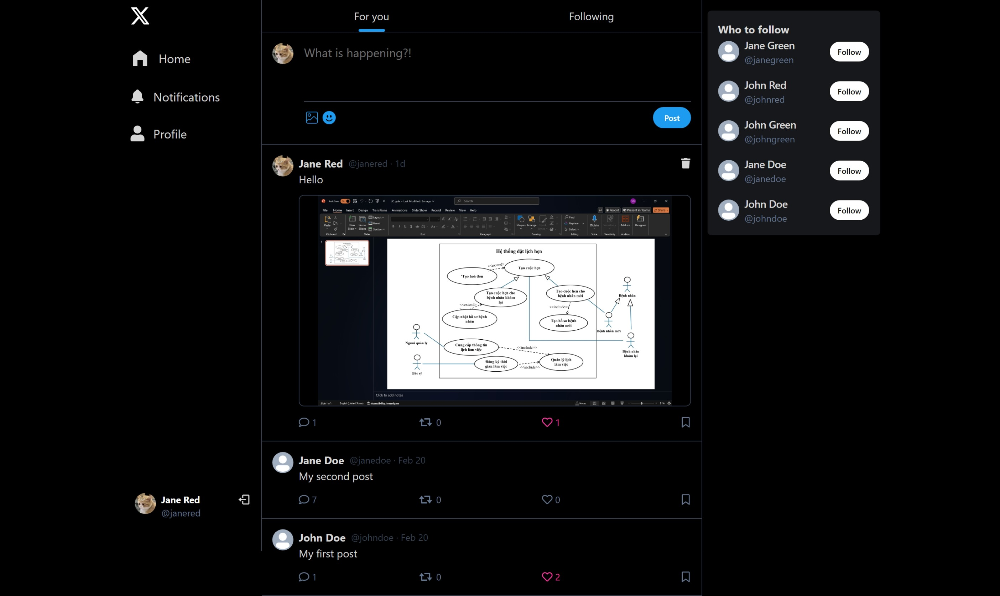

# 🐦 Twitter Clone

A simple Twitter clone built with modern web technologies, aiming to replicate core features like user authentication, tweeting, following, and real-time updates.



## ✨ Features

- **🔐 User Authentication**: Sign up, log in, log out
- **📝 Tweet Management**: Create, edit, and delete tweets
- **👥 User Interaction**: Follow and unfollow users
- **⚡ Real-Time Updates**: New tweets and notifications
- **📱 Responsive Design**: Optimized for mobile and desktop
- **🔄 Data Fetching**: React Query for data fetching and caching
- **👤 Suggested Users**: Follow recommendations
- **🗂️ Post Management**: Create, delete, and comment on posts
- **❤️ Post Interactions**: Like posts
- **🛠️ Profile Management**: Edit profile info, cover image, and profile image
- **📷 Image Uploads**: Using Cloudinary
- **🔔 Notifications**: Send and receive notifications
- **🚀 Deployment**: Ready for deployment
- **🔧 And much more!**

## 🛠️ Technologies Used

- **Frontend**: React, Tailwind CSS
- **Backend**: Node.js, Express
- **Database**: MongoDB
- **Authentication**: JWT (JSON Web Tokens)
- **Real-Time Updates**: Socket.io

## ⚙️ Installation

1. **📥 Clone the repository**:
    ```bash
    git clone https://github.com/trungvd2011/twitter-clone.git
    ```
2. **📂 Navigate to the project directory**:
    ```bash
    cd twitter-clone
    ```
3. **🔧 Setup .env file**:
    ```bash
    MONGO_URI=...
    PORT=...
    JWT_SECRET=...
    NODE_ENV=...
    CLOUDINARY_CLOUD_NAME=...
    CLOUDINARY_API_KEY=...
    CLOUDINARY_API_SECRET=...
    ```
4. **🔨 Build the app**:
    ```bash
    npm run build
    ```
5. **🚀 Start the app**:
    ```bash
    npm start
    ```